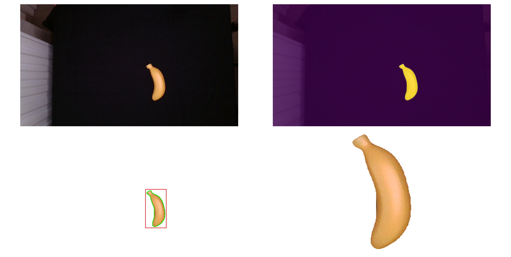
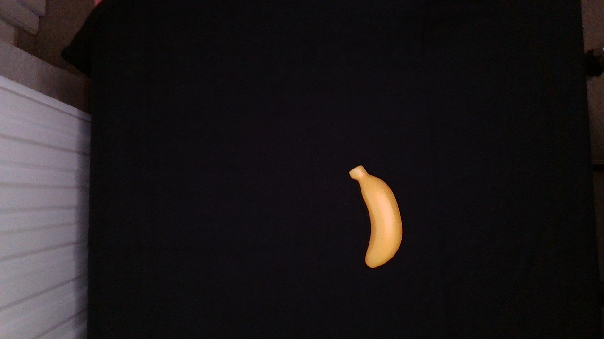
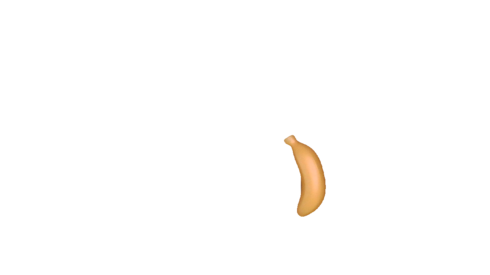
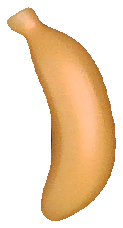

# YOLO Training and evaluation
This is a basic training script for a YOLO segmentation model. It uses the [`ultralytics`][1] package for training and evaluation and the [`backgroundremover`][2] package for the generation of the segmentation masks.


## Installation
In general, you have to follow the installation instructions of the used packages ([`ultralytics`][1] and [`backgroundremover`][2]).

However, we use some additional packages frameworks and in the following are the installation instructions using [`miniconda`][3]:

```bash
conda create -n yolo-seg python=3.10
conda activate yolo-seg

pip install -r requirements.txt
```

## Data preparation
For the data preparation step, we created two script (1) to  create segmentation masks and cut out the objects of interest, and (2) to create the dataset with according annotations that can be used by the training script.

### Image segmentations
For this step, we assume that the object of interest is located on a homogeneous background. In the filenames, we encode the class of the object, which is followed by an underscore and a image index, e.g. `banana_10.png`.


Using the `backgroundremover` package, we can create the segmentation masks for the objects of interest. The script `segment.py` can be used for this purpose.

```bash
./segment.py data.root=<path-to-data> dest=<output_path>
```
By omitting the `dest` parameter, the script will display the segmentation masks and the cut-out objects.



If `dest` is set, the script will save the segmentation masks, the cut-out objects, and the original images in the specified directory. Each class will be saved in a separate subdirectory.
```bash
./segment.py data.root=examples/raw_data dest=examples/segmented
```
```bash
tree examples/segmented
examples/segmented
├── cropped
│   └── banana
│       └── 0010.png
├── masked
│   └── banana
│       └── 0010.png
└── original
    └── banana
        └── 0010.png
```
<table>
<tr>
<th>Original</th>
<th>Masked</th>
<th>Cropped</th>
<tr>
<td></td>
<td></td>
<td></td>
</tr>
</table>

### Dataset and annotation creation
The script `create_dataset.py` uses the cropped images and a set ob background images to create the dataset and the annotations for the training script.

```bash
./create_dataset.py data.images_root=<path-to-cropped-objects> data.backgrounds_root=<path-to-background-images> dest=<output_path>
```

You can controll the number created images per class by setting `subsets.<subset_name>=<number>`. Valid subset names are `train`, `val`, and `test`.

```bash
./create_dataset.py data.images_root=examples/dest/cropped data.backgrounds_root=examples/backgrounds dest=examples/dataset subsets.train=2 subsets.val=1 subsets.test=1
```
```bash
tree examples/dataset

examples/dataset
├── data.yaml
├── images
│   ├── test
│   │   └── banana
│   │       └── 000000.jpg
│   ├── train
│   │   └── banana
│   │       ├── 000000.jpg
│   │       └── 000001.jpg
│   └── val
│       └── banana
│           └── 000000.jpg
└── labels
    ├── test
    │   └── banana
    │       └── 000000.txt
    ├── train
    │   └── banana
    │       ├── 000000.txt
    │       └── 000001.txt
    └── val
        └── banana
            └── 000000.txt
```
## Training
Finally, using created dataset and the data configuration file `data.yaml`, we can start the training.

```bash
./main.py data.config=examples/dataset/data.yaml
```

The outputs are saved in the `runs/segment` directory. To evaluate the trained model select the trained weights and run the main scrtip in the validation mode.

```bash
./main.py mode=validate data.config=examples/dataset/data.yaml model.weights=runs/segment/train/weights/best.pt
```

[1]: https://github.com/ultralytics/ultralytics
[2]: https://github.com/nadermx/backgroundremover
[3]: https://docs.anaconda.com/miniconda/
